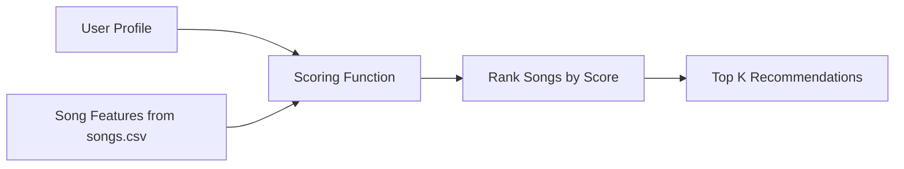

# 🎵 Music Recommender Simulation

## Project Summary

In this project you will build and explain a small music recommender system.

Your goal is to:

- Represent songs and a user "taste profile" as data
- Design a scoring rule that turns that data into recommendations
- Evaluate what your system gets right and wrong
- Reflect on how this mirrors real world AI recommenders

Replace this paragraph with your own summary of what your version does.

---

## How The System Works

Explain your design in plain language.

The system is a content-based music recommender that suggests songs based on how well their features match the preferences of the user. Each song is described using attributes like genre, mood and numerical values associated with energy and tempo. The user also provides a profile of test with the values that are preferred for these features.

The recommender will compare each song to the user profile. Then it assigns a score based on how closely the song will match the user preferences. Then it will rank all songs from highest to lowest score. The songs that are top-scoring will be returned as recommendations.

Some prompts to answer:

- What features does each `Song` use in your system
  - For example: genre, mood, energy, tempo

- genre: the overall category of the song (e.g., pop, rock, lofi)
- mood: the emotional tone (e.g., happy, chill, intense)
- energy: how intense or active the song feels (0 to 1)
- valence: how positive or negative the song feels (0 to 1)
- danceability: how suitable the song is for dancing (0 to 1)
- tempo_bpm: the speed of the song in beats per minute
- acousticness: how acoustic vs electronic the song is (0 to 1)

- What information does your `UserProfile` store

The UserProfile stores the musical preferences of the user. At this time including:

- favorite_genre: the genre the user prefers most
- favorite_mood: the mood the user prefers
- target_energy: the desired energy level
- target_valence: the desired positivity level
- target_danceability: the preferred level of danceability
- target_tempo_bpm: the preferred tempo
- target_acousticness: the preferred acoustic vs electronic feel

- How does your `Recommender` compute a score for each song

The recommender will compute a score for each song using a weighted scoring system.

- It adds points if the song’s genre matches the user’s favorite genre
- It adds points if the song’s mood matches the user’s preferred mood
- For numerical features (energy, valence, danceability, tempo, acousticness), it calculates how close the song’s value is to the user’s target value
- Songs that are closer to the user’s preferences receive higher scores

Each feature contributes a portion of the total score, allowing the system to balance multiple aspects of a song’s “vibe.”

- How do you choose which songs to recommend

After computing scores for all songs, the recommender sorts them from highest to lowest score. The top K songs (for example, the top 3 or top 5) are selected as the final recommendations.

This ranking ensures that the songs that best match the user’s preferences are shown first.

You can include a simple diagram or bullet list if helpful.

### Proposed or Recommended Flow

1. Load song data from `songs.csv`
2. Store the user's taste profile
3. Compare each song to the user profile
4. Compute a weighted score for each song
5. Rank songs from highest to lowest score
6. Return the top recommendations

The diagram below shows how user preferences and song features flow through the system:



### Algorithm Recipe

- Add 2.0 points when or if the song genre matches the user's favorite genre
- Add 1.5 points when or if the song mood matches the user's preferred mood
- Add similarity-based points for numerical features such as energy, danceability, tempo, acousticness or valence
- Numerical features are scored on the basis of how close their are to the target values from the user
- Songs are to be ranked from the highest to lowest total score
- The top K songs are returned as recommendations

### Potential Biases

A potential bias that comes to mind is that this recommender may over-prioritize and focus on songs that match the favorite genre and mood of the user. As a result of this dataset being small, there are certain genres and moods that may be overrepresented, and this can lead to recommendations that could be considered to be repetitive. The system also assumes all users have similarities in regards to their preference patterns. This may not reflect real-world variations regarding taste.
---

## Getting Started

### Setup

1. Create a virtual environment (optional but recommended):

   ```bash
   python -m venv .venv
   source .venv/bin/activate      # Mac or Linux
   .venv\Scripts\activate         # Windows

2. Install dependencies

```bash
pip install -r requirements.txt
```

3. Run the app:

```bash
python -m src.main
```

### Running Tests

Run the starter tests with:

```bash
pytest
```

You can add more tests in `tests/test_recommender.py`.

---

## Experiments You Tried

Use this section to document the experiments you ran. For example:

- What happened when you changed the weight on genre from 2.0 to 0.5
- What happened when you added tempo or valence to the score
- How did your system behave for different types of users

## Experiments You Tried

I ran several experiments to understand how different features and weights affect the recommender’s behavior.

First, I tested the system with three different user profiles: High-Energy Pop, Chill Lofi, and Intense Rock. The recommender performed well when there were strong matches in both genre and mood. For example, Sunrise City ranked highest for High-Energy Pop, Library Rain and Midnight Coding ranked highest for Chill Lofi, and Storm Runner ranked highest for Intense Rock. This showed that the system can correctly identify songs that match a user’s core preferences.

Next, I experimented with reducing the genre weight from 2.0 to 0.5. This made the recommender rely more on mood and numeric features like energy, valence, danceability, tempo, and acousticness. As a result, cross-genre songs appeared more frequently in the top recommendations. For example, Rooftop Lights ranked above Gym Hero in the High-Energy Pop profile, and Spacewalk Thoughts ranked above Focus Flow in the Chill Lofi profile, even without matching genre. This showed that lowering the genre weight increases flexibility but can reduce alignment with a user’s stated genre preference.

I also observed the impact of adding multiple numeric features such as valence, danceability, tempo, and acousticness. These features helped the recommender capture a song’s overall “vibe” more accurately. Even when genre or mood did not match exactly, songs with similar energy, tempo, and emotional tone were still recommended. This made the system more nuanced and realistic compared to using only categorical features.

Overall, the recommender behaves best when there is a balance between categorical features (genre and mood) and numeric features (energy, valence, danceability, tempo, acousticness). Higher weights on genre make recommendations more strict and predictable, while lower weights allow for more diverse, vibe-based recommendations.

---

## Limitations and Risks

This recommender system has several limitations due to its simplicity and small dataset.

- It only works on a small catalog of songs, which limits the diversity of recommendations.
- It does not consider lyrics, cultural context, or user listening history, which are important factors in real-world music preference.
- The system may over-prioritize certain features like genre and mood depending on their weights.
- It assumes all users can be represented by the same type of preference profile, which may not reflect real-world variation in taste.

These limitations mean the system can produce reasonable recommendations, but it is not as nuanced or adaptive as real-world platforms like Spotify or YouTube.

---


## Reflection

For a more detailed analysis of the recommender system, including evaluation, biases, limitations, and intended use, see the Model Card:

[Model Card](model_card.md)

Read and complete `model_card.md`:

[**Model Card**](model_card.md)

Write 1 to 2 paragraphs here about what you learned:

- about how recommenders turn data into predictions
- about where bias or unfairness could show up in systems like this

This project helped me understand how recommender systems turn user preferences into predictions using a combination of rules and data. By assigning weights to different features like genre, mood, and energy, I was able to see how small changes in logic can significantly impact the recommendations. It showed me that even simple scoring systems can feel effective if the features are well chosen.

I also learned how bias can appear in recommendation systems. For example, giving too much weight to genre can create a filter bubble where users only see similar types of content, while reducing that weight can lead to more varied but less targeted recommendations. This made me realize that designing a recommender system is not just about accuracy, but also about balancing user expectations, variation, and fairness.

---

## 7. `model_card_template.md`

Combines reflection and model card framing from the Module 3 guidance. :contentReference[oaicite:2]{index=2}  

```markdown
# 🎧 Model Card - Music Recommender Simulation

## 1. Model Name

Give your recommender a name, for example:

> VibeFinder 1.0

---

## 2. Intended Use

- What is this system trying to do
- Who is it for

Example:

> This model suggests 3 to 5 songs from a small catalog based on a user's preferred genre, mood, and energy level. It is for classroom exploration only, not for real users.

---

## 3. How It Works (Short Explanation)

Describe your scoring logic in plain language.

- What features of each song does it consider
- What information about the user does it use
- How does it turn those into a number

Try to avoid code in this section, treat it like an explanation to a non programmer.

---

## 4. Data

Describe your dataset.

- How many songs are in `data/songs.csv`
- Did you add or remove any songs
- What kinds of genres or moods are represented
- Whose taste does this data mostly reflect

---

## 5. Strengths

Where does your recommender work well

You can think about:
- Situations where the top results "felt right"
- Particular user profiles it served well
- Simplicity or transparency benefits

---

## 6. Limitations and Bias

Where does your recommender struggle

Some prompts:
- Does it ignore some genres or moods
- Does it treat all users as if they have the same taste shape
- Is it biased toward high energy or one genre by default
- How could this be unfair if used in a real product

---

## 7. Evaluation

How did you check your system

Examples:
- You tried multiple user profiles and wrote down whether the results matched your expectations
- You compared your simulation to what a real app like Spotify or YouTube tends to recommend
- You wrote tests for your scoring logic

You do not need a numeric metric, but if you used one, explain what it measures.

---

## 8. Future Work

If you had more time, how would you improve this recommender

Examples:

- Add support for multiple users and "group vibe" recommendations
- Balance diversity of songs instead of always picking the closest match
- Use more features, like tempo ranges or lyric themes

---

## 9. Personal Reflection

A few sentences about what you learned:

- What surprised you about how your system behaved
- How did building this change how you think about real music recommenders
- Where do you think human judgment still matters, even if the model seems "smart"

--

## 10. Sample Output


=== High-Energy Pop ===

Sunrise City - Score: 8.21
Because: genre match (+2.0), mood match (+1.5), energy similarity (+1.47), valence similarity (+0.94), danceability similarity (+0.91), acousticness similarity (+0.66), tempo similarity (+0.73)

Gym Hero - Score: 6.22
Because: genre match (+2.0), energy similarity (+1.30), valence similarity (+0.87), danceability similarity (+0.82), acousticness similarity (+0.56), tempo similarity (+0.66)

Rooftop Lights - Score: 6.16
Because: mood match (+1.5), energy similarity (+1.44), valence similarity (+0.91), danceability similarity (+0.88), acousticness similarity (+0.71), tempo similarity (+0.72)

Night Drive Loop - Score: 4.35
Because: energy similarity (+1.42), valence similarity (+0.59), danceability similarity (+0.97), acousticness similarity (+0.69), tempo similarity (+0.68)

Storm Runner - Score: 3.99
Because: energy similarity (+1.33), valence similarity (+0.58), danceability similarity (+0.96), acousticness similarity (+0.60), tempo similarity (+0.51)


=== Chill Lofi ===

Library Rain - Score: 8.31
Because: genre match (+2.0), mood match (+1.5), energy similarity (+1.50), valence similarity (+1.00), danceability similarity (+0.92), acousticness similarity (+0.71), tempo similarity (+0.69)

Midnight Coding - Score: 8.15
Because: genre match (+2.0), mood match (+1.5), energy similarity (+1.40), valence similarity (+0.96), danceability similarity (+0.88), acousticness similarity (+0.68), tempo similarity (+0.73)

Focus Flow - Score: 6.80
Because: genre match (+2.0), energy similarity (+1.42), valence similarity (+0.99), danceability similarity (+0.90), acousticness similarity (+0.73), tempo similarity (+0.75)

Spacewalk Thoughts - Score: 6.02
Because: mood match (+1.5), energy similarity (+1.40), valence similarity (+0.95), danceability similarity (+0.91), acousticness similarity (+0.66), tempo similarity (+0.60)

Coffee Shop Stories - Score: 4.68
Because: energy similarity (+1.47), valence similarity (+0.89), danceability similarity (+0.96), acousticness similarity (+0.68), tempo similarity (+0.68)


=== Intense Rock ===

Storm Runner - Score: 8.28
Because: genre match (+2.0), mood match (+1.5), energy similarity (+1.48), valence similarity (+0.98), danceability similarity (+0.94), acousticness similarity (+0.68), tempo similarity (+0.70)

Gym Hero - Score: 5.70
Because: mood match (+1.5), energy similarity (+1.46), valence similarity (+0.73), danceability similarity (+0.72), acousticness similarity (+0.64), tempo similarity (+0.65)

Night Drive Loop - Score: 4.36
Because: energy similarity (+1.27), valence similarity (+0.99), danceability similarity (+0.87), acousticness similarity (+0.73), tempo similarity (+0.49)

Sunrise City - Score: 4.13
Because: energy similarity (+1.38), valence similarity (+0.66), danceability similarity (+0.81), acousticness similarity (+0.73), tempo similarity (+0.55)

Rooftop Lights - Score: 3.99
Because: energy similarity (+1.29), valence similarity (+0.69), danceability similarity (+0.78), acousticness similarity (+0.64), tempo similarity (+0.59)


### Screenshot of CLI Output

