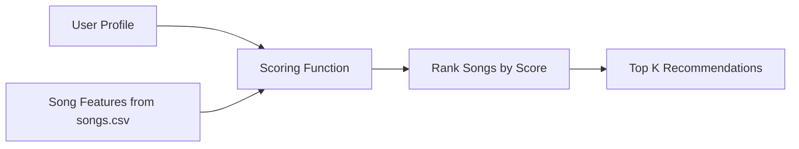
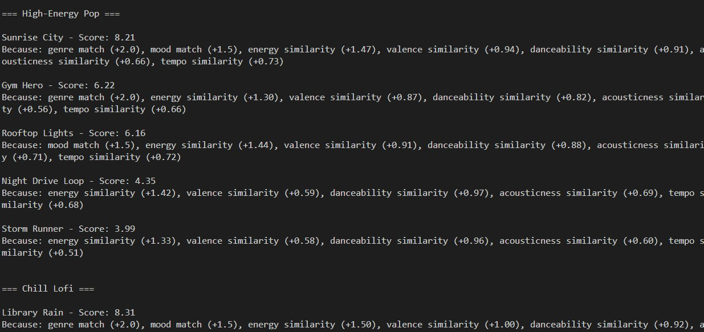

# 🎵 Music Recommender Simulation

## Project Summary

This project implements a content-based music recommender system that suggests songs based on how closely they match a user’s preferences. Songs and users are represented using both categorical features (genre, mood) and numerical features (energy, valence, danceability, tempo, acousticness). The system computes a weighted score for each song and returns the top recommendations along with explanations. This project demonstrates how simple scoring logic can simulate real-world recommendation systems.

---

## How The System Works

The system is a content-based music recommender that suggests songs based on how well their features match the preferences of the user. Each song is described using attributes like genre, mood and numerical values associated with energy and tempo. The user also provides a profile of taste with the values that are preferred for these features.

The recommender will compare each song to the user profile. Then it assigns a score based on how closely the song will match the user preferences. Then it will rank all songs from highest to lowest score. The songs that are top-scoring will be returned as recommendations.

Some prompts to answer:

- What features does each `Song` use in your system
  - For example: genre, mood, energy, tempo

- genre: the overall category of the song (e.g., pop, rock, lofi)
- mood: the emotional tone (e.g., happy, chill, intense)
- energy: how intense or active the song feels (0 to 1)
- valence: how positive or negative the song feels (0 to 1)
- danceability: how suitable the song is for dancing (0 to 1)
- tempo_bpm: the speed of the song in beats per minute
- acousticness: how acoustic vs electronic the song is (0 to 1)

- What information does your `UserProfile` store

The UserProfile stores the musical preferences of the user. At this time including:

- favorite_genre: the genre the user prefers most
- favorite_mood: the mood the user prefers
- target_energy: the desired energy level
- target_valence: the desired positivity level
- target_danceability: the preferred level of danceability
- target_tempo_bpm: the preferred tempo
- target_acousticness: the preferred acoustic vs electronic feel

- How does your `Recommender` compute a score for each song

The recommender will compute a score for each song using a weighted scoring system.

- It adds points if the song’s genre matches the user’s favorite genre
- It adds points if the song’s mood matches the user’s preferred mood
- For numerical features (energy, valence, danceability, tempo, acousticness), it calculates how close the song’s value is to the user’s target value
- Songs that are closer to the user’s preferences receive higher scores

Each feature contributes a portion of the total score, allowing the system to balance multiple aspects of a song’s “vibe.”

- How do you choose which songs to recommend

After computing scores for all songs, the recommender sorts them from highest to lowest score. The top K songs (for example, the top 3 or top 5) are selected as the final recommendations.

This ranking ensures that the songs that best match the user’s preferences are shown first.

You can include a simple diagram or bullet list if helpful.

### Proposed or Recommended Flow

1. Load song data from `songs.csv`
2. Store the user's taste profile
3. Compare each song to the user profile
4. Compute a weighted score for each song
5. Rank songs from highest to lowest score
6. Return the top recommendations

The diagram below shows how user preferences and song features flow through the system:



### Algorithm Recipe

- Add 2.0 points when or if the song genre matches the user's favorite genre
- Add 1.5 points when or if the song mood matches the user's preferred mood
- Add similarity-based points for numerical features such as energy, danceability, tempo, acousticness or valence
- Numerical features are scored on the basis of how close they are to the target values from the user
- Songs are to be ranked from the highest to lowest total score
- The top K songs are returned as recommendations

### Potential Biases

- The model may over-prioritize genre and mood, reducing recommendation variation.
- A small dataset can cause certain genres or moods to be overrepresented, leading to repetitive outputs.
- The system assumes a single, static preference profile, which does not capture real-world variability in user taste.

---

## Getting Started

### Setup

1. Create a virtual environment (optional but recommended):

   ```bash
   python -m venv .venv
   source .venv/bin/activate      # Mac or Linux
   .venv\Scripts\activate         # Windows

2. Install dependencies

```bash
pip install -r requirements.txt
```

3. Run the app:

```bash
python -m src.main
```

### Running Tests

Run the starter tests with:

```bash
pytest
```

You can add more tests in `tests/test_recommender.py`.

---

## Experiments You Tried

I ran several experiments to understand how different features and weights affect the recommender’s behavior.

First, I tested the system with three different user profiles: High-Energy Pop, Chill Lofi, and Intense Rock. The recommender performed well when there were strong matches in both genre and mood. For example, Sunrise City ranked highest for High-Energy Pop, Library Rain and Midnight Coding ranked highest for Chill Lofi, and Storm Runner ranked highest for Intense Rock. This showed that the system can correctly identify songs that match a user’s core preferences.

Next, I experimented with reducing the genre weight from 2.0 to 0.5. This made the recommender rely more on mood and numeric features like energy, valence, danceability, tempo, and acousticness. As a result, cross-genre songs appeared more frequently in the top recommendations. For example, Rooftop Lights ranked above Gym Hero in the High-Energy Pop profile, and Spacewalk Thoughts ranked above Focus Flow in the Chill Lofi profile, even without matching genre. This showed that lowering the genre weight increases flexibility but can reduce alignment with a user’s stated genre preference.

I also observed the impact of adding multiple numeric features such as valence, danceability, tempo, and acousticness. These features helped the recommender capture a song’s overall “vibe” more accurately. Even when genre or mood did not match exactly, songs with similar energy, tempo, and emotional tone were still recommended. This made the system more nuanced and realistic compared to using only categorical features.

Overall, the recommender behaves best when there is a balance between categorical features (genre and mood) and numeric features (energy, valence, danceability, tempo, acousticness). Higher weights on genre make recommendations more strict and predictable, while lower weights allow for more diverse, vibe-based recommendations.

---
## Sample Output


=== High-Energy Pop ===

Sunrise City - Score: 8.21
Because: genre match (+2.0), mood match (+1.5), energy similarity (+1.47), valence similarity (+0.94), danceability similarity (+0.91), acousticness similarity (+0.66), tempo similarity (+0.73)

Gym Hero - Score: 6.22
Because: genre match (+2.0), energy similarity (+1.30), valence similarity (+0.87), danceability similarity (+0.82), acousticness similarity (+0.56), tempo similarity (+0.66)

Rooftop Lights - Score: 6.16
Because: mood match (+1.5), energy similarity (+1.44), valence similarity (+0.91), danceability similarity (+0.88), acousticness similarity (+0.71), tempo similarity (+0.72)

Night Drive Loop - Score: 4.35
Because: energy similarity (+1.42), valence similarity (+0.59), danceability similarity (+0.97), acousticness similarity (+0.69), tempo similarity (+0.68)

Storm Runner - Score: 3.99
Because: energy similarity (+1.33), valence similarity (+0.58), danceability similarity (+0.96), acousticness similarity (+0.60), tempo similarity (+0.51)


=== Chill Lofi ===

Library Rain - Score: 8.31
Because: genre match (+2.0), mood match (+1.5), energy similarity (+1.50), valence similarity (+1.00), danceability similarity (+0.92), acousticness similarity (+0.71), tempo similarity (+0.69)

Midnight Coding - Score: 8.15
Because: genre match (+2.0), mood match (+1.5), energy similarity (+1.40), valence similarity (+0.96), danceability similarity (+0.88), acousticness similarity (+0.68), tempo similarity (+0.73)

Focus Flow - Score: 6.80
Because: genre match (+2.0), energy similarity (+1.42), valence similarity (+0.99), danceability similarity (+0.90), acousticness similarity (+0.73), tempo similarity (+0.75)

Spacewalk Thoughts - Score: 6.02
Because: mood match (+1.5), energy similarity (+1.40), valence similarity (+0.95), danceability similarity (+0.91), acousticness similarity (+0.66), tempo similarity (+0.60)

Coffee Shop Stories - Score: 4.68
Because: energy similarity (+1.47), valence similarity (+0.89), danceability similarity (+0.96), acousticness similarity (+0.68), tempo similarity (+0.68)


=== Intense Rock ===

Storm Runner - Score: 8.28
Because: genre match (+2.0), mood match (+1.5), energy similarity (+1.48), valence similarity (+0.98), danceability similarity (+0.94), acousticness similarity (+0.68), tempo similarity (+0.70)

Gym Hero - Score: 5.70
Because: mood match (+1.5), energy similarity (+1.46), valence similarity (+0.73), danceability similarity (+0.72), acousticness similarity (+0.64), tempo similarity (+0.65)

Night Drive Loop - Score: 4.36
Because: energy similarity (+1.27), valence similarity (+0.99), danceability similarity (+0.87), acousticness similarity (+0.73), tempo similarity (+0.49)

Sunrise City - Score: 4.13
Because: energy similarity (+1.38), valence similarity (+0.66), danceability similarity (+0.81), acousticness similarity (+0.73), tempo similarity (+0.55)

Rooftop Lights - Score: 3.99
Because: energy similarity (+1.29), valence similarity (+0.69), danceability similarity (+0.78), acousticness similarity (+0.64), tempo similarity (+0.59)

---



---

## Limitations and Risks

This recommender system has several limitations due to its simplicity and small dataset.

- It only works on a small catalog of songs, which limits the diversity of recommendations.
- It does not consider lyrics, cultural context, or user listening history, which are important factors in real-world music preference.
- The system may over-prioritize certain features like genre and mood depending on their weights.
- It assumes all users can be represented by the same type of preference profile, which may not reflect real-world variation in taste.

These limitations mean the system can produce reasonable recommendations, but it is not as nuanced or adaptive as real-world platforms like Spotify or YouTube.

---

## Reflection

Read and complete `model_card.md`:

[**Model Card**](model_card.md)

This project helped me understand how recommender systems turn user preferences into predictions using a combination of rules and data. By assigning weights to different features like genre, mood, and energy, I was able to see how small changes in logic can significantly impact the recommendations. It showed me that even simple scoring systems can feel effective if the features are well chosen.

I also learned how bias can appear in recommendation systems. For example, giving too much weight to genre can create a filter bubble where users only see similar types of content, while reducing that weight can lead to more varied but less targeted recommendations. This made me realize that designing a recommender system is not just about accuracy, but also about balancing user expectations, variation, and fairness.

---
